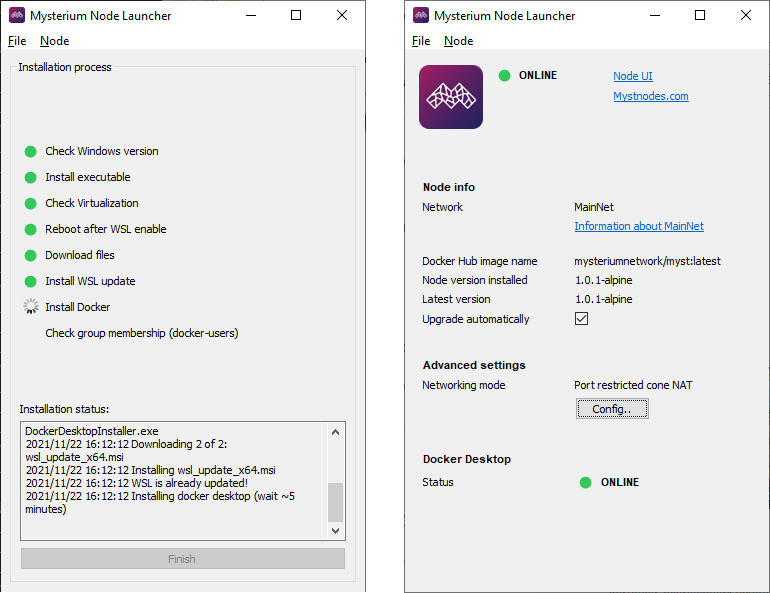

# Mysterium Exit Node Launcher

## Requirements
* You must be running Windows 10 version 2004 or above.
* WSL only runs on 64-bit versions of Windows 10. 32-bit versions are not supported.

To check that the computer meet the requirements, follow these steps:

1. Open your Settings. You can do this by clicking the gear icon on the Start menu, or by opening the Power User Tasks menu and choosing Settings.
1. In the Settings window, choose System.
2. On the left side of the System window, choose About.
On the right side of the window, system information is displayed. Make sure the Version is at least 1607, and the System type is a 64-bit operating system.

## Getting started
* Review all system requirements
* Exit myst-node-launcher prior to installation, if you have one.
* Download and run myst-node-launcher
* On finish click "Open Node UI". It will open http://localhost:4449 in browser
* Remark: A logout might be required during an installation, if your current desktop session has no effective membership in a "docker-users" group

## Screenshot

